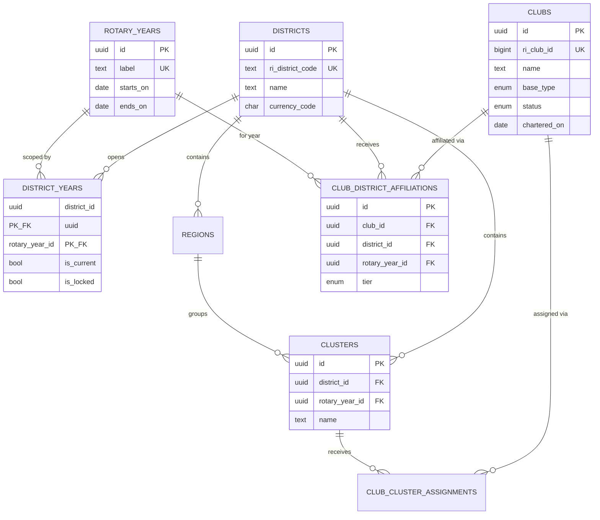
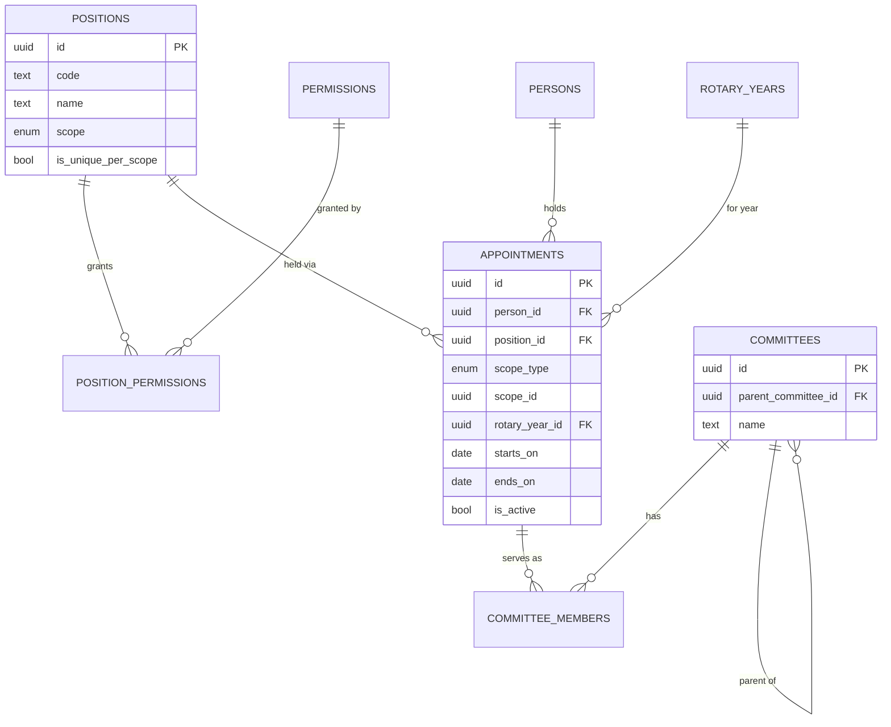
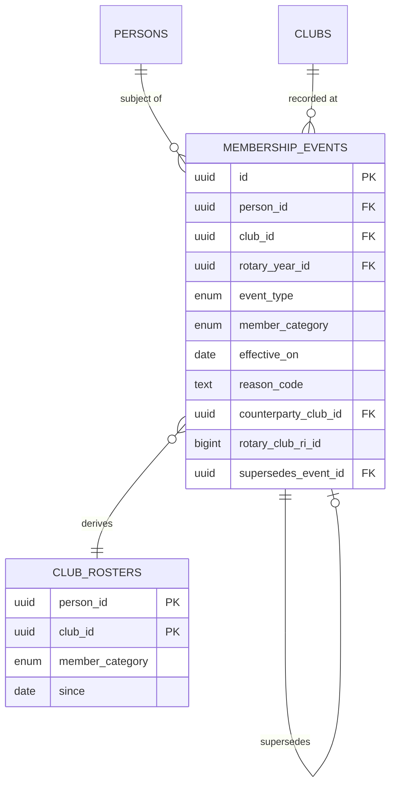
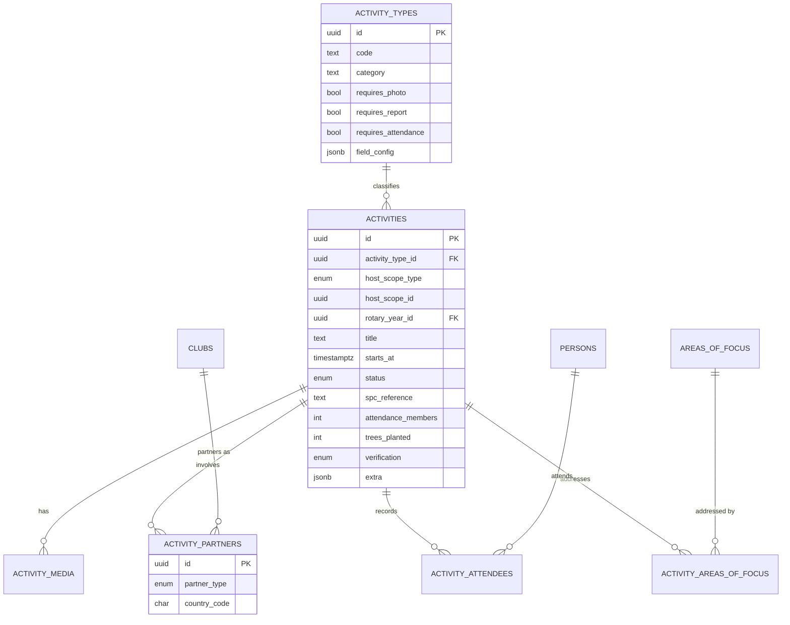
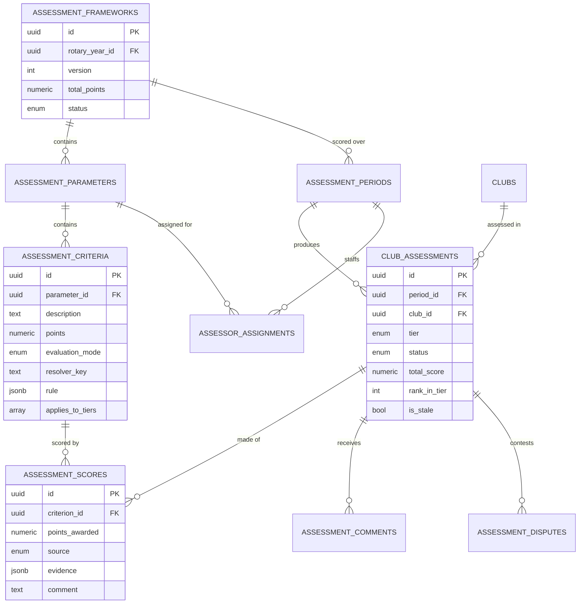

# 03 — Data Model

The authoritative definition is `schema.sql`. This document explains the reasoning, so that a future maintainer changing the schema understands what they are about to break.

The model is presented as six domain ERDs rather than one wall-sized diagram. A single diagram of forty-plus entities is unreadable and therefore never read.

---

## 1. Organisation



**Why clubs have no `district_id`.** This is the single most consequential decision in the schema and the one most likely to be "simplified" by a future contributor who does not understand it.

D9218 is being formed by splitting D9214. Clubs are moving. If district were a column on `clubs`, then on the day a club moves, either its historical records follow it into a district it was never in, or they are orphaned. Neither is acceptable when those records determine awards.

Affiliation is therefore `(club, district, rotary_year)`. A club's 2026-27 activity belongs to 9214 forever; its 2027-28 activity belongs to 9218. Both remain queryable. The next boundary change costs one row per club instead of a migration and an argument.

The same reasoning applies to clusters, which are redrawn every year by every incoming DRR.

**Tier is stored on the affiliation, not the club,** because tier is a function of roster size at the start of a year and must not change retroactively when members join in March. It is recalculated once, at rollover, and then frozen.

**`ri_club_id` is the external key.** The incumbent system matched clubs by name, which produced the district's own logged defect: *"naming of clubs, system vs assessment criteria."* Names are typed by humans, differ between RI and local usage, and change. RI IDs do not. Every club record must carry one before it can be assessed.

---

## 2. People, identity and consent

```mermaid
erDiagram
    PERSONS ||--o| USERS : "may authenticate as"
    PERSONS ||--|| PERSON_VISIBILITY : controls
    PERSONS ||--o{ CONSENTS : grants
    USERS ||--o{ USER_TOKENS : issues

    PERSONS {
        uuid id PK
        bigint ri_member_id UK
        text first_name
        text last_name
        citext email UK
        text phone
        text occupation
    }
    USERS {
        uuid id PK
        uuid person_id FK_UK
        text password_hash
        enum status
        bool mfa_enabled
    }
    PERSON_VISIBILITY {
        uuid person_id PK_FK
        bool show_email
        bool show_phone
        bool directory_optout
    }
    CONSENTS {
        uuid id PK
        uuid person_id FK
        text consent_type
        text policy_version
        timestamptz granted_at
        timestamptz revoked_at
    }
```

**Person and user are separate.** Most people in the district will never log in — they are members whose data is recorded by a secretary. Conflating identity with authentication forces you to create credentials for three thousand people who do not want them, and makes deactivating a login accidentally delete a member's history.

**Visibility defaults to false.** Every boolean in `person_visibility` that governs contact data starts closed. This is the schema-level expression of the correction to the incumbent system's central failure — four thousand people's phone numbers served to anyone who visited a URL. A default of `TRUE` here would reproduce the entire problem, so the default is written into the DDL rather than left to application code.

**Consent is versioned.** When the privacy policy changes, existing consent does not silently carry over — the new version must be granted. Uganda's Data Protection and Privacy Act 2019 requires a demonstrable lawful basis; a row with a timestamp, a policy version and a source IP is what "demonstrable" means in practice.

---

## 3. Governance



**Nobody has a role. People hold appointments.** An appointment is `(person, position, org unit, year)`. Authorisation resolves through it every request.

Three problems disappear as a consequence. Annual turnover becomes automatic — on 1 July, last year's appointments are out of scope and last year's access ends without an administrator revoking anything. New positions become data: D9218's RY2027-28 slate has over thirty distinct positions including several that did not previously exist, and adding "Deputy District Learning Facilitator" is an insert, not a release. And a person holding two positions — common in Rotaract — is two rows rather than an impossible case.

`scope_id` is deliberately untyped (a bare UUID rather than a foreign key), because it may reference a club, cluster, region or committee. This is the one place the schema trades referential integrity for polymorphism; validate it in the service layer.

**Committees self-reference** so that a chair can create sub-committees without a developer — the district asked for exactly this and could not have it.

---

## 4. Membership



**The roster is a materialised view, not a table.** This inverts how most membership systems are built, and it is the reason a long list of district requests become free.

The incumbent system stored current state. Every one of these logged requests then required new development: transitioned members report, reason why a member left, all members who left across all clubs, percentage joined versus left, corporate versus honorary versus newly inducted, which club a transfer came from. Each is a question about *change*, and a snapshot of current state cannot answer any of them.

With an event log, all of them are `SELECT`s. So are retention rate, net growth, churn by cluster, and average tenure — questions nobody has asked yet but somebody will.

**Events are never edited.** A mistake is corrected by a `CORRECTION` event pointing at the original through `supersedes_event_id`. The original stays. When a club disputes its membership score in April, you can reconstruct exactly what was known on any date. Editable history and contested awards are incompatible.

**Transitions to Rotary are first-class,** with the receiving Rotary club and a corroboration timestamp, because the district's own criterion requires the member to appear on both sides. The corroboration field is what makes that verifiable rather than asserted.

---

## 5. Activity



**One table for everything a club does.** Fellowships, service projects, international service, youth programmes, PLD sessions, club assemblies, in-house trainings, cluster activities, ADRR and DRR visits, presidential forums, committee activities — all rows in `activities`, distinguished by `activity_type_id`.

The incumbent system built each as its own form and table, which is why the district's backlog contains a long tail of "add X as an activity type" requests that will never end. Here, a new type is an insert into `activity_types` by an administrator. No deployment.

**Field requirements are configuration.** `requires_photo`, `requires_report`, `requires_attendance` live on the type. The district's request that *"extra activities should not require a photo"* is a checkbox, not a ticket.

**International service is derived, not declared.** A club cannot tick a box claiming international service. It qualifies when `activity_partners.country_code <> 'UG'` — which means the scoring engine can verify it and a club cannot inflate it. This is a small design choice with a large integrity payoff, and it generalises: wherever possible, make the scored fact derivable from structured data rather than from a self-assessment.

**`extra JSONB`** absorbs genuinely type-specific fields without a schema change. Use it sparingly. Anything queried by the scoring engine belongs in a real column, because JSONB predicates are slow and easy to get subtly wrong.

---

## 6. Assessment



**The rubric is data, and this is the whole point of the system.**

The district's RY2025-26 criteria — 12 parameters, roughly 50 criteria, 100 points — currently live in a spreadsheet and are applied by hand by seven assessors across roughly 140 clubs, monthly and quarterly. That is thousands of manual judgements a year, most of them arithmetic.

Here the rubric is rows. The PIME Chair authors it in the interface, previews it against last year's data, publishes it, and it locks. Next year's chair clones and edits it without touching a developer. Hard-coding this year's weights would simply relocate the current problem into a new codebase — which is the specific failure this project exists to avoid.

**`evidence JSONB` on every score** records what the resolver actually saw: the counts, the thresholds, the identifiers of the contributing rows. When a club disputes a score in April, the answer is on screen rather than in someone's memory. This field is what makes automated scoring defensible in a room full of club presidents.

**`is_stale`** drives incremental recomputation. Writing an activity, a membership event, a TRF contribution or a dues payment flags the affected assessments; the nightly job recomputes only those. Recomputing all clubs every night would work at this scale, but staleness makes on-demand recomputation fast enough to show a club its score moving the same day it reports — which is the feature that will actually drive adoption.

**Disputes are modelled, not emailed.** An award system without a dispute process generates the arguments anyway; they just happen in WhatsApp groups with no record.

---

## 7. Conventions and pitfalls

| Convention | Reason |
|---|---|
| UUID primary keys | Prevents enumeration; enables client-generated IDs for offline sync |
| `rotary_year_id` on every transactional table | Axiom 1; enforced by the data access layer, never by hand |
| `district_id` on every tenant-scoped table | Axiom 2 of tenancy; cheap now, prohibitive later |
| Lookup tables over native enums for anything an officer might add | Positions, activity types and finance categories change yearly |
| Native enums for fixed system values | `activity_status`, `invoice_status` — changing these is legitimately a code change |
| Soft delete (`deleted_at`) on governed entities | Award disputes require reconstructable history |
| `NUMERIC` for money, never `FLOAT` | Rounding errors in dues reconciliation are indefensible |
| `TIMESTAMPTZ` everywhere, never `TIMESTAMP` | Multi-district future; correctness across DST-free but UTC-offset reasoning |
| Storage keys, not URLs, in the database | Lets you change storage provider or CDN without a data migration |

**Three traps specifically worth naming:**

*Do not add `district_id` to `clubs`.* It will look like an obvious simplification to someone six months from now. It destroys redistricting history. The comment in `schema.sql` says so; this document says why.

*Do not let anything write to the roster directly.* The moment one code path updates `club_rosters` instead of appending an event, the log stops being the truth and every derived metric becomes unreliable.

*Do not store SQL in `assessment_criteria.rule`.* The rule references a named resolver from a code registry with parameters. Storing SQL in configuration is a SQL-injection vector authored by your own administrators, and it makes the scoring engine untestable.