# 04 — Diagrams

Data flow diagrams, use case diagrams, sequence diagrams and state machines. All Mermaid; render in GitHub, VS Code, or any Mermaid viewer.

---

## 1. Data flow diagrams

### 1.1 Level 0 — context

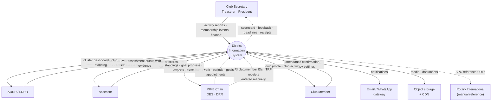

The dotted lines matter. RI provides no general-purpose API for this data, so integration is **reference capture and reconciliation**, never a live feed. Any plan that assumes otherwise will fail in month three.

### 1.2 Level 1 — major processes

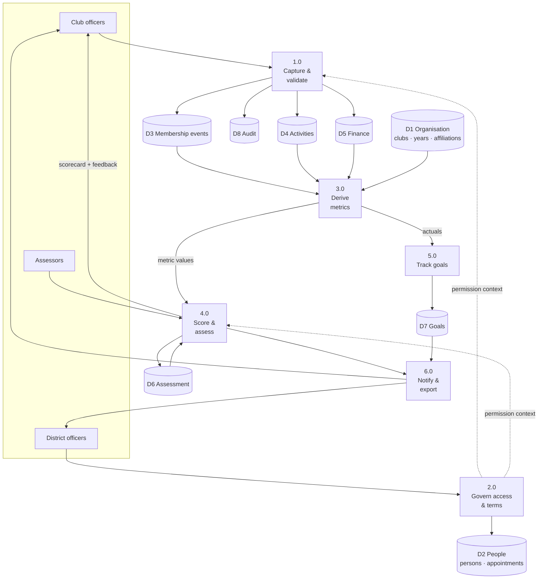

Process 3.0 is the layer the incumbent system has never had: everything downstream of capture. Note that 3.0 reads from the data stores and writes nothing — metric derivation is pure. That property is what makes the scoring engine testable.

### 1.3 Level 2 — assessment scoring (process 4.0)

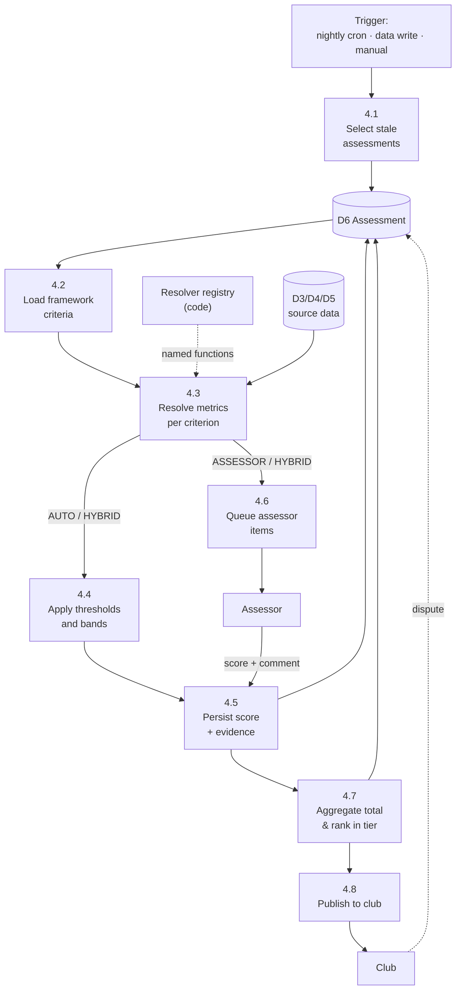

`4.3` is the only place source data is read for scoring, and `REG` is a code registry — never SQL in the database.

---

## 2. Use case diagrams

### 2.1 Club-level actors

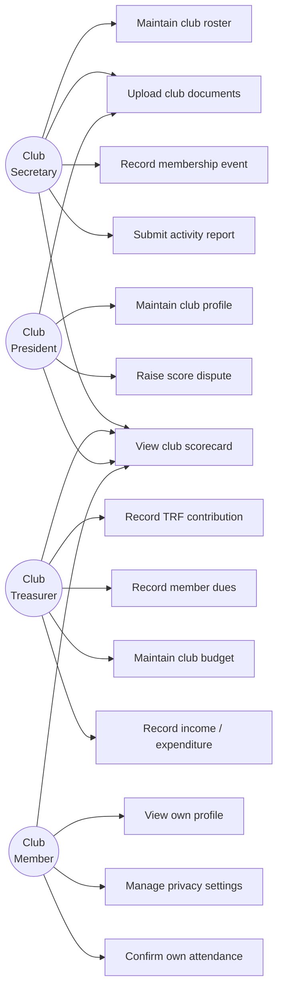

### 2.2 District-level actors

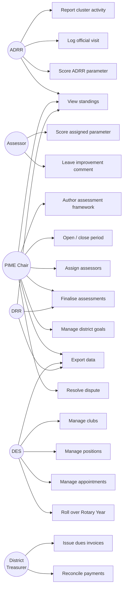

---

## 3. Sequence diagrams

### 3.1 Offline-tolerant activity submission (UC-01)

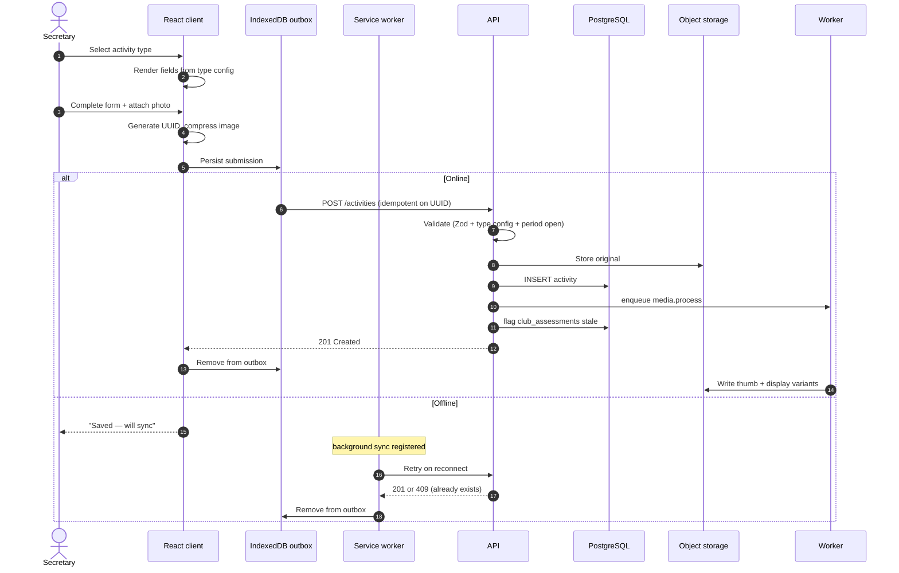

Step 4 is why UUIDs are client-generated. Retry after an ambiguous failure is safe: the server either creates the row or recognises it already has it. Without this, a dropped connection produces duplicate reports — a defect visible on the incumbent system's own public feed today.

### 3.2 Nightly assessment recomputation (UC-04)

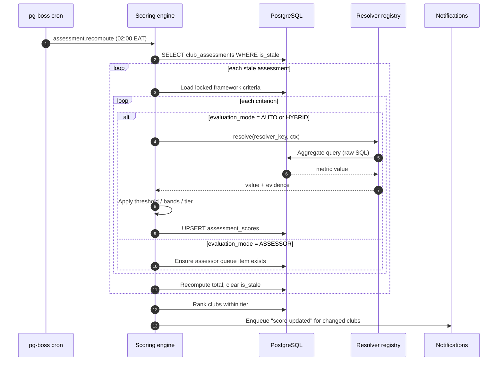

### 3.3 Rotary Year rollover (UC-06)

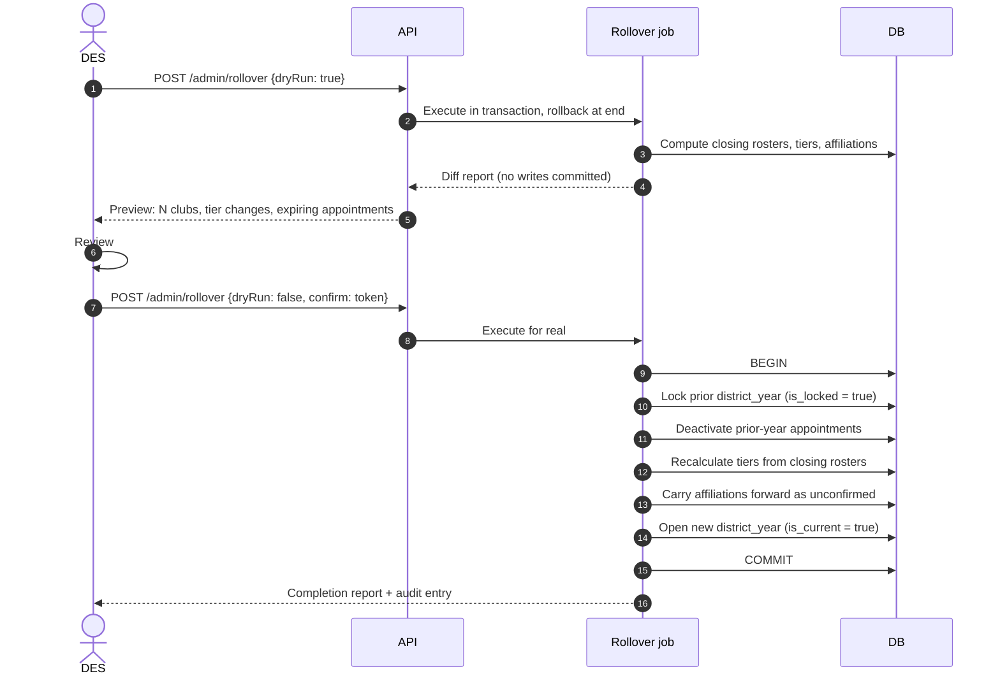

Dry run is not a nicety. This operation touches every club and every appointment, runs once a year, and is therefore the least-tested code path in the system on the day it matters most.

---

## 4. State machines

### 4.1 Club assessment

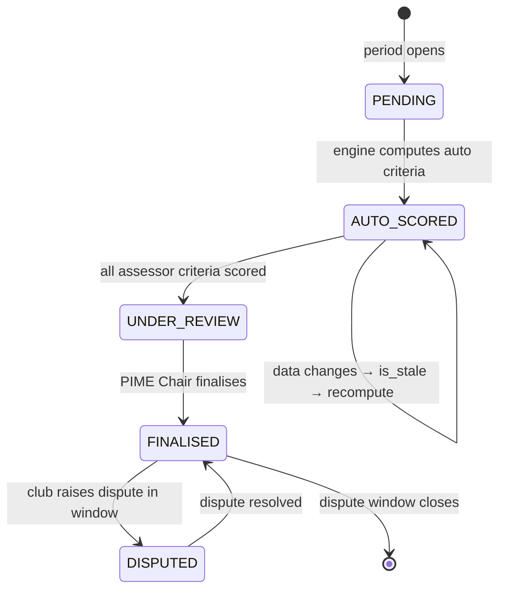

Note the self-loop: an assessment recomputes freely until it is finalised. After finalisation, only a dispute can change it, and every change is audited.

### 4.2 Assessment period

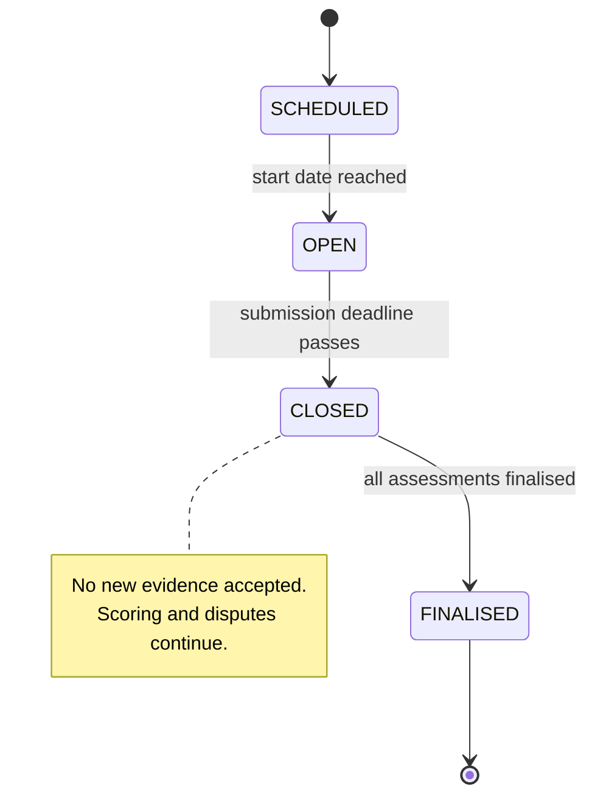

### 4.3 Assessment framework

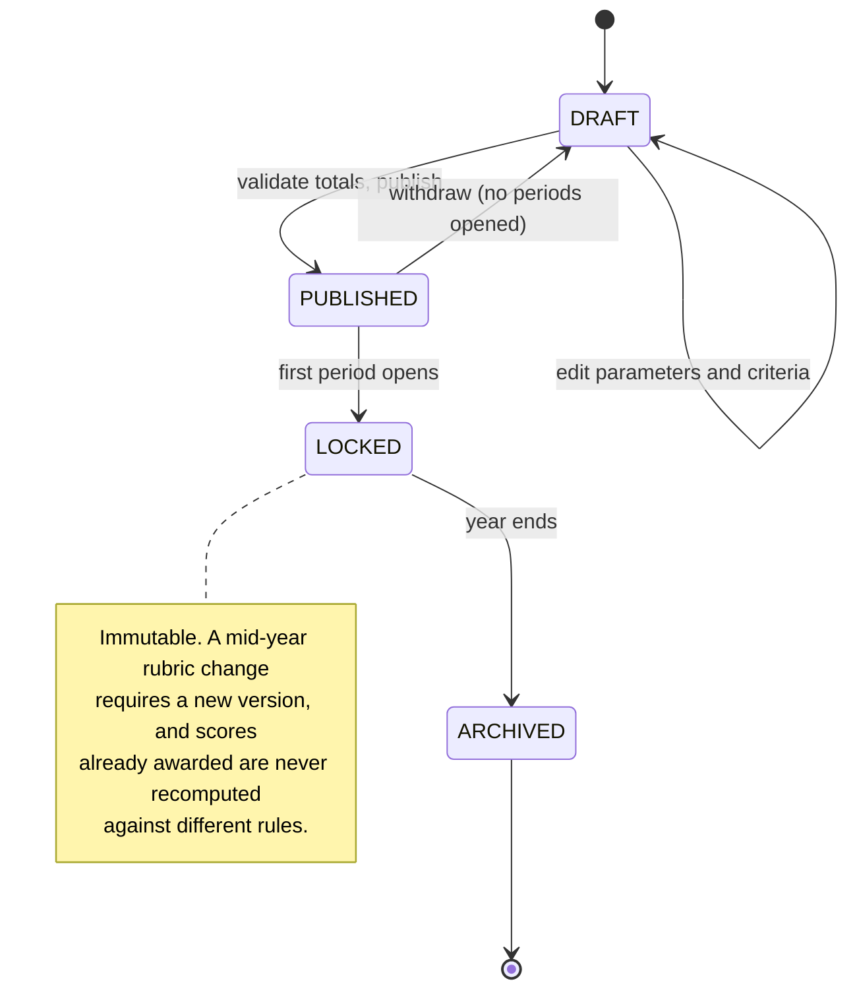

### 4.4 Activity verification

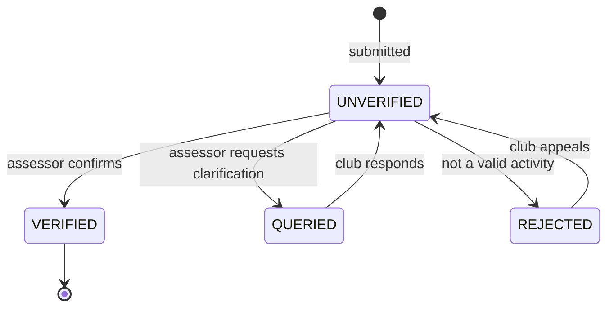

`QUERIED` is the state the incumbent system lacks entirely — the district's own note asked *"where can PIME leave comments for improvement?"* This is the answer, and it is what converts a write-only reporting portal into a two-way system.

### 4.5 Dues invoice

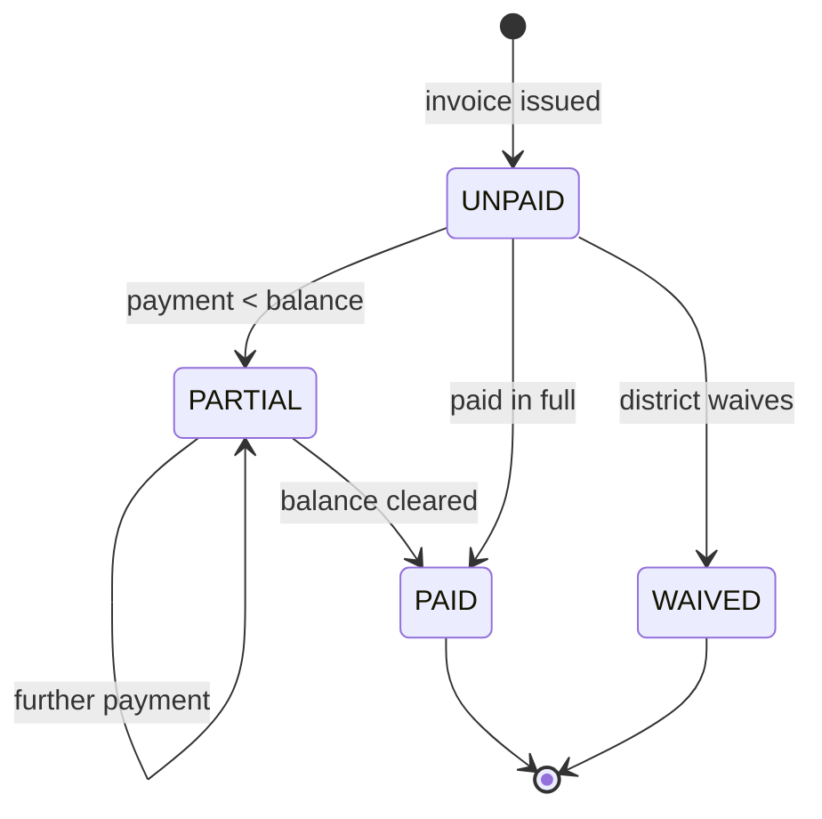